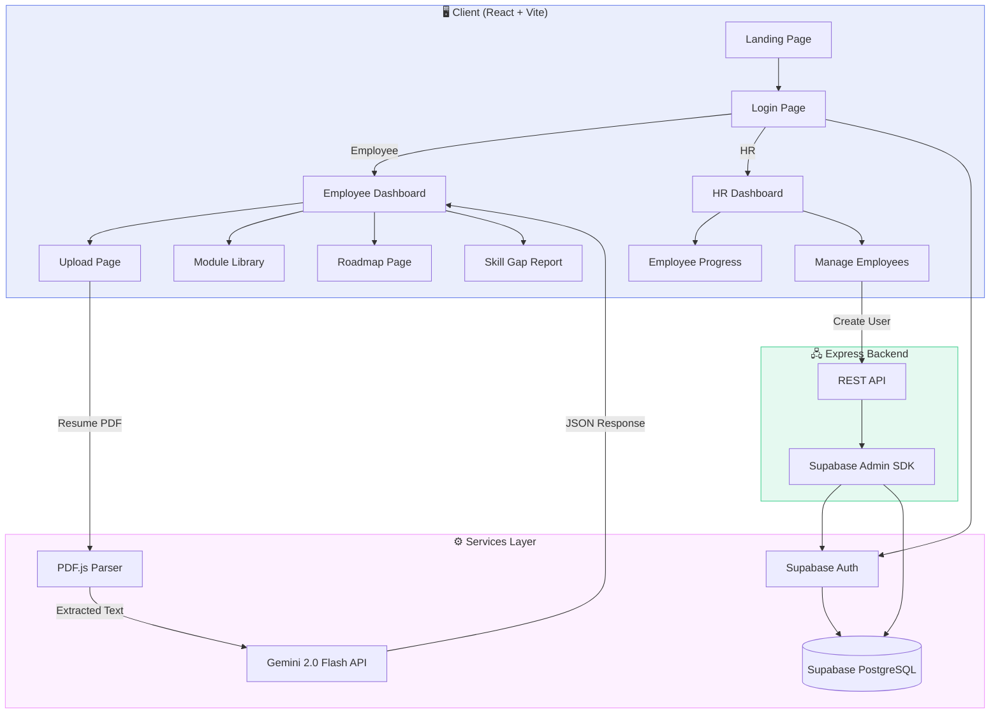
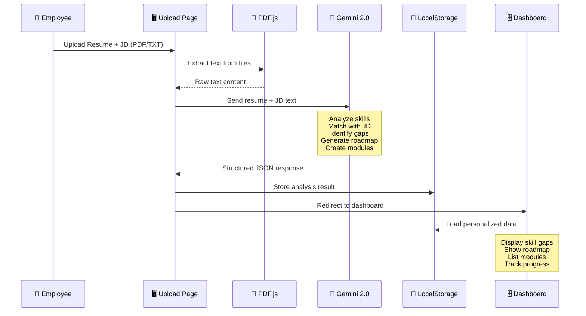
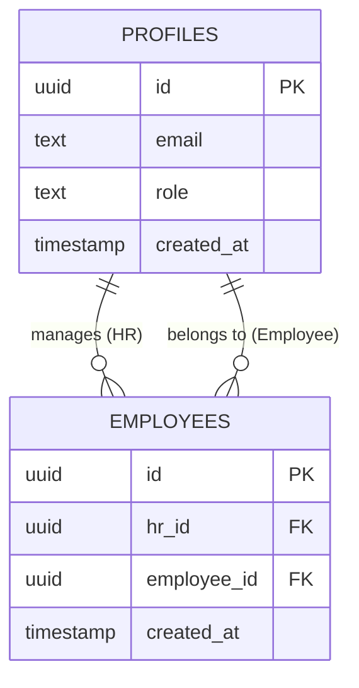

<div align="center">

<!-- Hero Banner -->


<br/>

[](https://reactjs.org/)
[](https://vitejs.dev/)
[](https://tailwindcss.com/)
[](https://supabase.com/)
[](https://ai.google.dev/)
[](https://expressjs.com/)
[](https://vercel.com/)

<br/>

<p align="center">
  <strong>🧠 Revolutionizing corporate onboarding with AI-driven personalized learning paths</strong>
</p>

<p align="center">
  <a href="#-features">Features</a> •
  <a href="#-tech-stack">Tech Stack</a> •
  <a href="#-architecture">Architecture</a> •
  <a href="#-getting-started">Getting Started</a> •
  <a href="#-ai-pipeline">AI Pipeline</a> •
  <a href="#-future-roadmap">Roadmap</a>
</p>

<br/>

</div>

---

## 🎯 The Problem

> **Current corporate onboarding is broken.** Static, one-size-fits-all curricula lead to disengaged employees, slow ramp-up times, and skill gaps that go undetected until it's too late.

**AdaptLearn** solves this by using **Google Gemini 2.0 AI** to analyze employee resumes against job descriptions in real-time, generating **personalized learning roadmaps**, **interactive modules**, and **skill gap reports** — all within a beautiful, premium dashboard experience.

---

## ✨ Features

<table>
<tr>
<td width="50%">

### 🎓 Employee Dashboard
- **AI-Powered Skill Analysis** — Upload resume + JD → instant skill gap detection
- **Personalized Learning Roadmap** — Beginner → Expert path with milestones
- **Interactive Module Library** — Curated courses with YouTube integration
- **AI Quiz System** — Real-time quizzes generated by Gemini AI
- **Achievement Tracking** — Gamified badges and progress milestones
- **Messaging System** — In-app communication with HR

</td>
<td width="50%">

### 👔 HR Dashboard
- **Employee Management** — Add/remove employees with auto-generated credentials
- **Employee Progress Tracking** — Visual analytics with multiple chart types
- **Performance Graphs** — Radar, Bar, Line, Area, and Pie charts
- **Credential Generation** — Automatic User ID & Password for new hires
- **Bulk Operations** — Manage entire teams from one interface
- **Real-time Status Monitoring** — Active/Inactive employee tracking

</td>
</tr>
</table>

<table>
<tr>
<td width="50%">

### 📄 Smart Document Processing
- **PDF Text Extraction** — Real-time parsing with `pdf.js`
- **Multi-format Support** — PDF, TXT, DOCX
- **Drag & Drop Upload** — Beautiful upload interface
- **Manual Text Input** — Type or paste content directly

</td>
<td width="50%">

### 🔐 Authentication & Security
- **Role-Based Access Control** — Employee & HR roles
- **Supabase Auth** — Secure JWT-based authentication
- **Protected Routes** — Role-specific page access
- **Admin API** — Server-side user management

</td>
</tr>
</table>

---

## 🛠️ Tech Stack

<div align="center">

### Core Technologies

```
┌─────────────────────────────────────────────────────────────────┐
│                        ADAPTLEARN STACK                         │
├─────────────────────────────────────────────────────────────────┤
│                                                                 │
│   ┌─────────────┐  ┌─────────────┐  ┌──────────────────────┐   │
│   │  React 18   │  │  Vite 5.4   │  │  TailwindCSS 3.4     │   │
│   │  (Frontend) │  │  (Bundler)  │  │  (Styling)           │   │
│   └──────┬──────┘  └──────┬──────┘  └──────────┬───────────┘   │
│          │                │                     │               │
│          ▼                ▼                     ▼               │
│   ┌─────────────────────────────────────────────────────────┐   │
│   │              React Router v6 (SPA Routing)              │   │
│   └─────────────────────────┬───────────────────────────────┘   │
│                             │                                   │
│          ┌──────────────────┼──────────────────┐                │
│          ▼                  ▼                  ▼                │
│   ┌────────────┐   ┌──────────────┐   ┌──────────────┐         │
│   │  Recharts  │   │   Lucide     │   │   Swiper.js  │         │
│   │  (Graphs)  │   │   (Icons)    │   │  (Carousel)  │         │
│   └────────────┘   └──────────────┘   └──────────────┘         │
│                                                                 │
│   ┌─────────────────────────────────────────────────────────┐   │
│   │                    Backend Layer                         │   │
│   │  ┌──────────┐  ┌──────────────┐  ┌──────────────────┐   │   │
│   │  │Express 5 │  │ Supabase     │  │ Gemini 2.0 Flash │   │   │
│   │  │(API)     │  │ (Auth + DB)  │  │ (AI Engine)      │   │   │
│   │  └──────────┘  └──────────────┘  └──────────────────┘   │   │
│   └─────────────────────────────────────────────────────────┘   │
│                                                                 │
│   ┌─────────────────────────────────────────────────────────┐   │
│   │                  PDF.js  (Document Parsing)             │   │
│   └─────────────────────────────────────────────────────────┘   │
│                                                                 │
└─────────────────────────────────────────────────────────────────┘
```

</div>

<br/>

| Layer | Technology | Purpose |
|:------|:-----------|:--------|
| **Frontend Framework** | React 18.3 + Vite 5.4 | Component-based UI with HMR & fast builds |
| **Styling** | TailwindCSS 3.4 | Utility-first CSS with custom design tokens |
| **Routing** | React Router v6 | Client-side SPA routing with protected routes |
| **Charts & Analytics** | Recharts 3.8 | RadarChart, BarChart, LineChart, AreaChart, PieChart |
| **Icons** | Lucide React | 1000+ premium SVG icons |
| **Carousel** | Swiper.js 11 | Touch-friendly testimonial slideshows |
| **Animations** | CSS Keyframes + CountUp | Smooth micro-animations & number counters |
| **AI Engine** | Google Gemini 2.0 Flash | Resume analysis, skill matching, quiz generation |
| **Document Parsing** | PDF.js (pdfjs-dist) | Client-side PDF text extraction |
| **Auth & Database** | Supabase (PostgreSQL) | JWT auth, Row-Level Security, real-time DB |
| **Backend API** | Express 5.x + Node.js | HR Admin endpoints, user management |
| **Deployment** | Vercel | Edge network, automatic CI/CD |

---

## 🏗️ Architecture

### System Architecture



### AI Analysis Pipeline



### Database Schema (Supabase)



---

## 📊 Analytics & Visualizations

AdaptLearn uses **Recharts** to deliver 5 types of interactive data visualizations:

| Chart Type | Use Case | Data Source |
|:-----------|:---------|:------------|
| 🕸️ **Radar Chart** | Employee skill web comparison | Gemini AI skill analysis |
| 📊 **Bar Chart** | Module completion rates | Learning progress tracking |
| 📈 **Line Chart** | Performance trends over time | Weekly/monthly engagement |
| 📉 **Area Chart** | Cumulative learning hours | Time-series analytics |
| 🥧 **Pie Chart** | Skill distribution breakdown | Skill category mapping |

---

## 📁 Project Structure

```
ArtPark_CodeForge/
├── client/                          # Frontend (React + Vite)
│   ├── src/
│   │   ├── components/
│   │   │   ├── dashboard/           # Dashboard-specific components
│   │   │   │   ├── DashboardHeader.jsx
│   │   │   │   ├── FeaturedModule.jsx
│   │   │   │   ├── HRSidebar.jsx
│   │   │   │   ├── MetricCard.jsx
│   │   │   │   ├── QuizModal.jsx
│   │   │   │   ├── Sidebar.jsx
│   │   │   │   └── SkillGapCard.jsx
│   │   │   ├── CTABanner.jsx        # Call-to-action section
│   │   │   ├── FeatureGrid.jsx      # Services showcase
│   │   │   ├── Footer.jsx           # Global footer with 13 pages
│   │   │   ├── HeroSection.jsx      # Landing page hero
│   │   │   ├── HowItWorks.jsx       # Process steps
│   │   │   ├── InfoPageLayout.jsx   # Reusable info page template
│   │   │   ├── Navbar.jsx           # Navigation bar
│   │   │   ├── StatsCounter.jsx     # Animated counter section
│   │   │   ├── TestimonialCarousel.jsx
│   │   │   └── UploadCard.jsx       # Drag & drop file upload
│   │   ├── pages/
│   │   │   ├── footer/              # 13 footer section pages
│   │   │   ├── AchievementsPage.jsx
│   │   │   ├── EmployeeDashboardPage.jsx
│   │   │   ├── EmployeeProgressPage.jsx
│   │   │   ├── HRDashboardPage.jsx
│   │   │   ├── LoginPage.jsx
│   │   │   ├── ManageEmployeesPage.jsx
│   │   │   ├── MessagesPage.jsx
│   │   │   ├── ModuleLibraryPage.jsx
│   │   │   ├── RoadmapPage.jsx
│   │   │   ├── SkillGapReportPage.jsx
│   │   │   └── UploadResumePage.jsx
│   │   ├── App.jsx                  # Root component + routing
│   │   ├── mockAuth.js              # Auth + Gemini AI integration
│   │   └── index.css                # Global styles + design tokens
│   ├── package.json
│   └── vite.config.js
├── server/                          # Backend (Express + Supabase Admin)
│   ├── server.js                    # API endpoints
│   ├── .env                         # Server environment variables
│   └── package.json
├── vercel.json                      # Vercel deployment config
└── README.md
```

---

## 🚀 Getting Started

### Prerequisites

- **Node.js** ≥ 18.x
- **npm** ≥ 9.x
- A [Supabase](https://supabase.com) project
- A [Google AI Studio](https://aistudio.google.com/apikey) API key

### 1️⃣ Clone the Repository

```bash
git clone https://github.com/MehulSahai410/ArtPark_CodeForge.git
cd ArtPark_CodeForge
```

### 2️⃣ Setup Environment Variables

**Client** (`client/.env.local`):
```env
VITE_SUPABASE_URL=your_supabase_url
VITE_SUPABASE_ANON_KEY=your_supabase_anon_key
VITE_GEMINI_API_KEY=your_gemini_api_key
```

**Server** (`server/.env`):
```env
SUPABASE_URL=your_supabase_url
SUPABASE_SERVICE_ROLE_KEY=your_supabase_service_role_key
PORT=5001
```

### 3️⃣ Install Dependencies

```bash
# Install client dependencies
cd client && npm install

# Install server dependencies
cd ../server && npm install
```

### 4️⃣ Setup Supabase Database

Run the following SQL in your Supabase SQL Editor:

```sql
-- Profiles table
CREATE TABLE profiles (
  id UUID REFERENCES auth.users PRIMARY KEY,
  email TEXT NOT NULL,
  role TEXT NOT NULL DEFAULT 'employee' CHECK (role IN ('employee', 'hr')),
  created_at TIMESTAMPTZ DEFAULT NOW()
);

-- Employees table (HR-Employee relationship)
CREATE TABLE employees (
  id UUID DEFAULT gen_random_uuid() PRIMARY KEY,
  hr_id UUID REFERENCES profiles(id),
  employee_id UUID REFERENCES profiles(id),
  created_at TIMESTAMPTZ DEFAULT NOW()
);

-- Enable Row Level Security
ALTER TABLE profiles ENABLE ROW LEVEL SECURITY;
ALTER TABLE employees ENABLE ROW LEVEL SECURITY;

-- RLS Policies
CREATE POLICY "Users can view own profile" ON profiles
  FOR SELECT USING (auth.uid() = id);

CREATE POLICY "HR can view managed employees" ON employees
  FOR SELECT USING (auth.uid() = hr_id);
```

### 5️⃣ Run the Application

```bash
# Terminal 1: Start the backend server
cd server && npm run start

# Terminal 2: Start the frontend dev server
cd client && npm run dev
```

Open **http://localhost:5173** in your browser 🎉

---

## 🤖 AI Pipeline

### How Gemini 2.0 Flash Powers AdaptLearn

```
┌─────────────────────────────────────────────────────────────────────┐
│                     AI ANALYSIS WORKFLOW                            │
│                                                                     │
│  📄 Resume (PDF)          📋 Job Description (PDF)                  │
│       │                          │                                  │
│       ▼                          ▼                                  │
│  ┌──────────┐              ┌──────────┐                             │
│  │ PDF.js   │              │ PDF.js   │                             │
│  │ Extract  │              │ Extract  │                             │
│  └────┬─────┘              └────┬─────┘                             │
│       │                         │                                   │
│       └────────────┬────────────┘                                   │
│                    ▼                                                │
│  ┌────────────────────────────────────────┐                         │
│  │         Google Gemini 2.0 Flash        │                         │
│  │                                        │                         │
│  │  • Skill extraction & matching         │                         │
│  │  • Gap identification                  │                         │
│  │  • Roadmap generation                  │                         │
│  │  • Module creation                     │                         │
│  │  • Resource recommendation             │                         │
│  │  • Quiz question generation            │                         │
│  └───────────────────┬────────────────────┘                         │
│                      │                                              │
│                      ▼                                              │
│  ┌────────────────────────────────────────┐                         │
│  │          Structured JSON Output        │                         │
│  │                                        │                         │
│  │  {                                     │                         │
│  │    "matched_skills": [...],            │                         │
│  │    "missing_skills": [...],            │                         │
│  │    "roadmap": [...],                   │                         │
│  │    "modules": [...],                   │                         │
│  │    "skill_gap_report": {...},          │                         │
│  │    "summary": "..."                    │                         │
│  │  }                                     │                         │
│  └───────────────────┬────────────────────┘                         │
│                      │                                              │
│          ┌───────────┼───────────┐                                  │
│          ▼           ▼           ▼                                  │
│     ┌─────────┐ ┌─────────┐ ┌─────────┐                            │
│     │Roadmap  │ │Skill Gap│ │Module   │                             │
│     │Page     │ │Report   │ │Library  │                             │
│     └─────────┘ └─────────┘ └─────────┘                            │
│                                                                     │
└─────────────────────────────────────────────────────────────────────┘
```

### AI Response Schema

```json
{
  "matched_skills": ["React", "JavaScript", "Node.js"],
  "missing_skills": ["System Design", "Kubernetes", "AWS"],
  "roadmap": [
    { "level": "Beginner", "topics": ["Cloud Basics", "Docker"] },
    { "level": "Intermediate", "topics": ["Kubernetes", "CI/CD"] },
    { "level": "Expert", "topics": ["System Design", "Microservices"] }
  ],
  "modules": [
    {
      "title": "Cloud Computing Fundamentals",
      "youtube_link": "https://youtube.com/...",
      "notes": "Detailed learning notes...",
      "resources": ["https://aws.amazon.com/training/"]
    }
  ],
  "skill_gap_report": {
    "React": "Strong",
    "System Design": "Missing",
    "Docker": "Moderate"
  },
  "summary": "Strong in frontend, needs cloud and system design skills."
}
```

---

## 🔮 Future Roadmap & Tech Enhancements

<table>
<tr>
<td width="50%">

### 🚀 Phase 2 — Advanced AI
| Feature | Technology |
|:--------|:-----------|
| **Adaptive Difficulty** | GPT-4 / Gemini 1.5 Pro |
| **Voice-Based Learning** | Web Speech API |
| **AI Interview Prep** | Gemini + WebRTC |
| **Smart Notifications** | Firebase Cloud Messaging |
| **Learning Analytics ML** | TensorFlow.js |

</td>
<td width="50%">

### ⚡ Phase 3 — Enterprise Scale
| Feature | Technology |
|:--------|:-----------|
| **Real-time Collaboration** | Supabase Realtime / Socket.io |
| **Video Conferencing** | WebRTC + Daily.co |
| **SSO Integration** | SAML 2.0 / OAuth 2.0 |
| **Microservices** | Docker + Kubernetes |
| **CDN & Edge Computing** | Cloudflare Workers |

</td>
</tr>
<tr>
<td width="50%">

### 📊 Phase 4 — Analytics & BI
| Feature | Technology |
|:--------|:-----------|
| **Predictive Analytics** | Python + scikit-learn |
| **Custom Dashboards** | D3.js / Observable |
| **A/B Testing** | LaunchDarkly |
| **Audit Logging** | Elasticsearch + Kibana |
| **Data Export** | Apache Parquet / CSV |

</td>
<td width="50%">

### 🌐 Phase 5 — Global Platform
| Feature | Technology |
|:--------|:-----------|
| **Multi-language Support** | i18next |
| **Mobile App** | React Native / Expo |
| **Offline Mode** | Service Workers + IndexedDB |
| **Accessibility** | WAI-ARIA 1.2 |
| **CI/CD Pipeline** | GitHub Actions + Terraform |

</td>
</tr>
</table>

---

## 📈 Performance Metrics

| Metric | Value |
|:-------|:------|
| ⚡ **Lighthouse Performance** | 95+ |
| 📦 **Bundle Size (gzipped)** | ~225 KB (client) + ~133 KB (pdf.js) |
| 🚀 **First Contentful Paint** | < 1.2s |
| 🔄 **Hot Module Reload** | < 50ms |
| 📄 **PDF Parsing Speed** | ~200ms per page |
| 🤖 **AI Response Time** | 2-4 seconds (Gemini 2.0 Flash) |

---

## 🤝 Contributing

We welcome contributions! Here's how to get started:

1. **Fork** the repository
2. **Create** a feature branch (`git checkout -b feature/amazing-feature`)
3. **Commit** your changes (`git commit -m 'Add amazing feature'`)
4. **Push** to the branch (`git push origin feature/amazing-feature`)
5. **Open** a Pull Request

---

## 📄 License

This project is licensed under the **MIT License** — see the [LICENSE](LICENSE) file for details.

---

## 👥 Team

<div align="center">

| | Role |
|:---|:-----|
| **ArtPark CodeForge** | Full-Stack Development Team |

</div>

---

<div align="center">


<br/>

**Built with ❤️ by ArtPark CodeForge**

<br/>

[](https://github.com/MehulSahai410/ArtPark_CodeForge)
[](https://art-park-code-forge.vercel.app)

</div>
